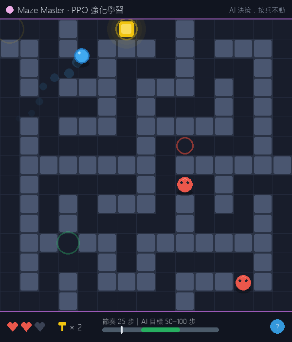
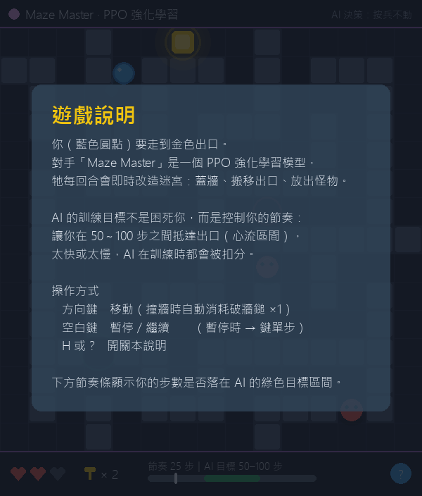

# Maze Agent RL: 基於深度強化學習與 PCGRL 的動態迷宮生成系統

[](https://www.python.org/)
[](https://stable-baselines3.readthedocs.io/)
[](https://gymnasium.farama.org/)
[](https://www.pygame.org/)

這是一個基於 **程序化內容生成 (PCGRL)** 的強化學習專案。在此系統中，一個 AI 代理人（Maze Master）透過 PPO (Proximal Policy Optimization) 演算法學習如何動態修改迷宮（放置牆壁、怪物、移動出口），目的是控制玩家（或 A\* 導航機器人）的通關時間，使其保持在「心流 (Flow)」狀態。

<p align="center">
  
  
</p>

> 此專案為學術研究與期末專題成果，展現了 RL Agent 如何在不讓遊戲變得「不可能通關」的前提下，最大化遊戲的挑戰性與趣味性。

## 📖 文件導覽

| 你是誰 | 該讀哪份 |
|---|---|
| 想快速上手跑起來 | 本 README |
| 想深入理解技術（環境設計、獎勵工程、實驗方法） | [docs/PROJECT_OVERVIEW.md](docs/PROJECT_OVERVIEW.md) |
| 完全不懂技術，想知道這東西有什麼實際用途與產業價值 | [docs/APPLICATIONS.md](docs/APPLICATIONS.md) |
| 要做簡報，對象是高中生 / 大學生 / 社會人士 / 主管外賓 | [docs/PRESENTATION_GUIDE.md](docs/PRESENTATION_GUIDE.md) |

## 📂 專案結構

```
Maze_Agent_RL/
├── agents/             # 代理人相關程式碼
│   └── astar_bot.py    # A* 路徑規劃機器人 (模擬玩家 + 怪物追蹤 + 可解性驗證)
├── envs/               # Gymnasium 環境定義
│   ├── maze_env.py     # 核心迷宮環境邏輯 (State, Action, Reward)
│   ├── maze_generator.py # 初始迷宮生成演算法 (DFS)
│   └── rendering.py    # Pygame 渲染引擎 (深色主題、特效、遊戲內教學)
├── docs/               # 技術文件、應用說明、簡報指南、環境流程圖
├── models/             # 訓練備份與歷史實驗模型 (見 models/README.md)
├── maze_master_ppo.zip # 正式使用中的模型 (main.py 載入此檔)
├── config.py           # 全域參數設定 (獎勵、顏色、模式、時間限制)
├── train.py            # PPO 訓練腳本 (GPU + 8 進程並行 + 玩家個性隨機化)
├── main.py             # 遊戲主程式 (載入模型並視覺化演示)
├── evaluate.py         # 模型效能評估腳本 (1000 回合統計報告)
├── experiment_runner.py# 消融實驗與數據收集 (CSV)
├── adaptation_check.py # 動態難度調整能力檢驗 (對不同水準玩家的行為分析)
├── test_smoke.py       # 環境不變式煙霧測試
└── requirements.txt    # 專案依賴套件
```

## 🚀 快速開始

### 1. 安裝環境

建議使用 Python 3.12.9 或以上版本。

```bash
# 安裝相依套件
pip install -r requirements.txt
```

> ⚠️ **Windows + NVIDIA GPU 使用者注意**：PyPI 預設安裝的是 **CPU 版 PyTorch**，訓練會慢非常多。
> 請額外執行以下指令換成 CUDA 版（mac 不需要）：
>
> ```bash
> pip install torch==2.9.1 --index-url https://download.pytorch.org/whl/cu128 --force-reinstall --no-deps
> ```

### 2. 訓練模型 (Train)

若要從頭訓練 Maze Master：

```bash
python train.py
```

- 自動偵測 GPU（啟動時會印出 `運算裝置: cuda/cpu`）。
- 使用 **8 個並行環境**（SubprocVecEnv）收集資料，RTX 4070 上約 950+ fps，50 萬步約 9 分鐘。
- 訓練時**每回合隨機抽樣玩家個性**（繞路程度 0~0.8、猶豫機率 0~0.3），
  避免模型只會對付完美 A* 玩家、提升對真實玩家的泛化能力。
- TensorBoard Log 儲存於 `./tensorboard_logs/`，模型儲存為 `maze_master_ppo.zip`，
  歷史備份在 `./models/`。

### 3. 執行演示 (Run)

載入訓練好的模型並觀看成果，或進行手動遊玩：

```bash
python main.py
```

### 4. 評估與實驗 (Evaluate)

```bash
python evaluate.py           # 單模型 1000 回合統計報告
python experiment_runner.py  # 消融實驗 (四種能力場景對照，輸出 CSV)
python adaptation_check.py   # 動態調整檢驗：對高手/普通/手殘玩家的行為差異分析
python test_smoke.py         # 環境不變式煙霧測試 (重構後防回歸)
```

## 🎮 操作說明 (main.py)

在 `main.py` 執行視窗中：

- **方向鍵 (上/下/左/右)**: 控制玩家移動，可按住連續移動（`HUMAN` 模式）；撞牆時自動消耗破牆鎚
- **Space (空白鍵)**: 暫停 / 繼續遊戲
- **Right Arrow (右方向鍵)**: 暫停時單步執行 (Step-by-step debug)
- **H 鍵或畫面右下角 `?` 按鈕**: 開關遊戲內教學說明（開啟時遊戲自動暫停）

畫面資訊：
- **頂部狀態列**: 即時顯示 Maze Master (PPO) 的每一步決策（蓋牆、搬出口、放怪物…）
- **底部儀表板**: 生命值、破牆鎚數量、**心流節奏條**（綠色區段 = AI 的 50–100 步目標區間）

## ⚙️ 設定調整 (config.py)

您可以在 `config.py` 中調整核心參數：

- **遊戲模式**: 修改 `PLAYER_MODE` 為 `"AI"` (A\* Bot) 或 `"HUMAN"` (手動遊玩)。
- **心流區間**: 調整 `TIME_MIN` 與 `TIME_MAX` 來設定目標通關步數範圍。
- **怪物設定**: 修改 `MONSTER_SPEED` 或 `MAX_MONSTERS`。
- **獎勵函數**: 調整 `REWARD_` 開頭的變數來改變 RL Agent 的學習目標。

## 🧠 核心機制

### Observer (State)

Agent 觀察到的狀態為一個 `(Grid Size * 4, Grid Size * 4)` 的圖像矩陣，包含牆壁、玩家位置、出口位置與怪物的分佈。

### Action Space

Agent 每回合可以執行多個 `MultiDiscrete` 動作，包含：

1.  **Skip**: 不做任何事。
2.  **Place Wall**: 在空地放置牆壁。
3.  **Remove**: 移除牆壁或怪物。
4.  **Move Exit**: 改變出口位置。
5.  **Spawn Monster**: 放置追蹤玩家的怪物。

### Reward System (Flow Control)

Agent 的目標不是殺死玩家，也不是讓玩家最快通關，而是：

- ✅ **Flow Success**: 玩家在 `TIME_MIN` ~ `TIME_MAX` 步數區間內通關 (高獎勵)。
- ⚠️ **Too Fast**: 玩家太快通關 (懲罰，迷宮太簡單)。
- ⚠️ **Too Slow/Timeout**: 玩家太慢或超時 (懲罰，迷宮太難或無聊)。
- ❌ **Blocked**: 路徑被堵死 (重罰，必須確保有解)。

## 📝 授權聲明 (License)

本專案採用 **自定義授權**。

⚠️ **使用限制：**
本軟體為作者之「期末專題」核心成果。

1.  **禁止** 未經書面同意的重製、修改、分發。
2.  **嚴禁** 第三方將本代碼用於個人專題、學術論文或競賽。
3.  僅供 **檢閱** 使用。

詳細條款請參閱 [LICENSE](LICENSE) 檔案。
